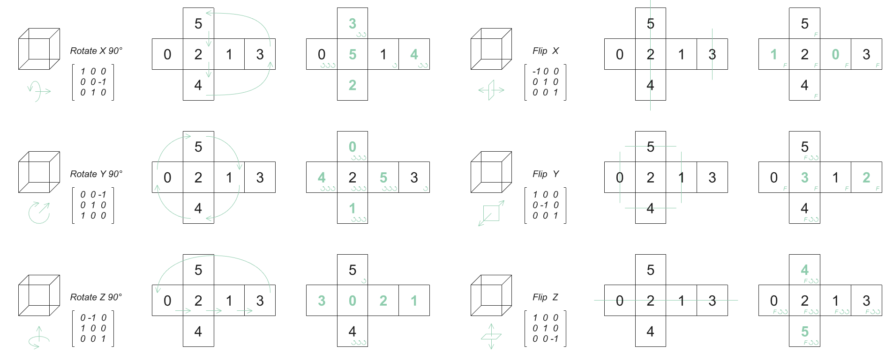

# FastTile3d
FastTile3d is not a Library but a thought. Its core is a fast method to pre-process the 3d tileset before the input of the WFC(wave function collapse) solver.

FastTile3d is aiming at simplifying the repetitive work of creating and arranging large amount of WFC asset for the game developers. It is derived from my own experience. There was one time that I tried to create a large tileset, with many parts reusing the same connection, and I realize it is too troublesome to set the rules by hand.
## Overview
The logic of FastTile3d is simple. We know that tiles are cube-like and each tile has 6 faces. Each face contains a group of tiles identifying its valid pairs. However, when we apply transform to the tile(e.g. rotation or mirror), the information contained by faces also changes. For easier, we can call the faces with information as "socket". FastTile3d is just a set of rules associating transform with the tiles and sockets.
## Define A Tile
Because of the law of WFC, rotation to a cube is restricted in 90 degrees at X, Y or Z axis. The mirror axis is also restricted in X, Y or Z plane. So after any transform, the result is still a cube with 6 sockets. For this, we should have a tile system to store the sockets in fix order, and break the the "transform to the tiles" question down to the "transform to the sockets" question. When we rotate or mirror a tile, the sockets shift or swap in order. At the same time, some shapes of sockets would be transformed. So we also need to record the "transform message" at the socket for differentiating its parent shape.

How many results of transform can one parent socket has in total? We know one socket has 4 rotations and 2 flips as its a square. Notice here I call it "flip" rather than "mirror", because we care about the differnence in shape but not the mirror plane. So it's easy to get the number of 8. To make sure we don't mess it up, when we record the transform message, the flip is recorded prior to the rotation. But what if the mirror tranform operation happens later than rotation? The answer is, we can translate it.

But is it true that every socket has 8 sub-sockets? Imagine that if we have a circle in a socket. No matter how we rotate and flip, the shape remains the same. So we have to know the law behind it. I notice that shapes can be categorized by its symmetry type, and it's highly relavent to the number of sub-sockets(some out of 8 have the same shape).

And also, the number of sub-sockets is relavent to how many symmetric axis at the square's centor the shape has. By this information, we can easily define different type of sockets without worring introducing repeated sockets when we transform a tile.
## Add Tiles To Tileset
When we initiate a tile we have already defined 6 sockets and their family types, transform messages, and names. After every time we transform the tile and add it to the tileset, we record the transform 3*3 matrix. At the same time, the tile generator will check if there is any socket different from the original. If yes, the new tile will be generated. Otherwise it won't. 

When we add this new tile to the tileset, the tileset will compare the matrix and sockets of new tile to every existed tile to avoid repitition.
## Generate Tile-Rules From Socket-Rules
We can store the socket connection rules in a dictionary. Every time we add a socket-pair into the dictionary, we automatically add its sub-pairs. Every socket has sub-sockets, so it's easy to understand that a socket-pair also has sub-pairs. Notice that the reverse pair should also be added because WFC is a undirected graph.

After the dictionary is created we can check tiles one by one to each other, by which we know if the according socket-pairs are in the dictionary. If yes, a new rule will be generated and add to tile-rules for WFC solver.
