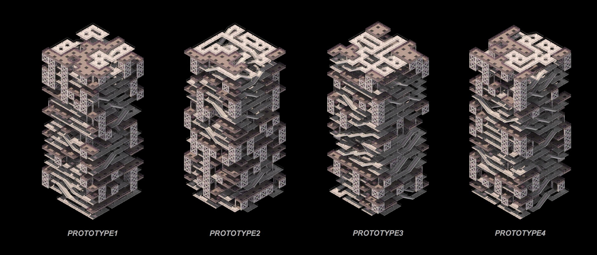

# EasyTileWFC

 

EasyTileWFC is not just a library but a concept. At its core, it provides an efficient method to preprocess 3D tilesets before they are used in a Wave Function Collapse (WFC) solver.  

 
 

EasyTileWFC aims to simplify the repetitive task of creating and organizing large numbers of WFC assets for game developers. This idea emerged from my own experience: while working on a large tileset with many reusable connections, I realized that manually setting the rules was tedious and inefficient.  

## Overview  

The logic behind EasyTileWFC is simple. Since tiles are cube-like, each tile has six faces. Each face contains a set of valid connection pairs. However, when a tile undergoes transformations such as rotation or mirroring, the information on its faces also changes. To simplify this, we refer to the faces containing this connection data as "sockets."  

EasyTileWFC provides a structured approach to associating transformations with tiles and their sockets.  

## Defining a Tile  

Due to the constraints of WFC, cube rotation is restricted to 90-degree increments along the X, Y, or Z axis, while mirroring is limited to the X, Y, or Z planes. Regardless of the transformation applied, the result remains a cube with six sockets.  

To handle this, we establish a tile system where sockets are stored in a fixed order, reducing the problem of "transforming tiles" to simply "transforming sockets." When a tile is rotated or mirrored, its sockets shift or swap accordingly, and some socket shapes may also transform. Therefore, we must record a "transformation message" for each socket to track changes in its parent shape.  

  

## Understanding Socket Transformations  

How many possible transformed versions can a single parent socket have? Since a socket is a square, it can undergo four rotations and two flips. Here, I use the term "flip" instead of "mirror" because we are concerned with shape differences rather than the mirroring plane. This results in a total of eight variations. To ensure consistency, flips are recorded before rotations. If a mirroring operation is applied after a rotation, it can be translated accordingly.  

  
  

However, not every socket has eight distinct variations. For example, if a socket contains a circular shape, its appearance remains unchanged regardless of rotation or flipping. The number of distinct variations depends on the shape's symmetry type, which directly influences the number of unique sub-sockets.  

  

Additionally, the number of sub-sockets is determined by the number of symmetry axes passing through the center of the square.  

  

With this information, we can accurately define different types of sockets without introducing duplicate variations. The diagram below illustrates how symmetric shapes are processed.  

  

## Adding Tiles to the Tileset  

When initializing a tile, we define its six sockets, family types, transformation messages, and names. The tile’s content is irrelevant as long as it has the same sockets as another tile.  

Each time we transform a tile and add it to the tileset, we record its 3×3 transformation matrix. The tile generator then checks whether any socket differs from the original. If differences exist, a new tile is generated; otherwise, the transformation is ignored.  

  

Before adding a new tile to the tileset, the system compares its matrix and sockets to existing tiles to prevent duplication.  

## Generating Tile Rules from Socket Rules  

Socket connection rules are stored in a dictionary. Whenever a socket pair is added, its corresponding sub-pairs are automatically included. Since each socket has multiple sub-sockets, each socket pair also has multiple sub-pairs. Additionally, because WFC operates as an undirected graph, reverse pairs must also be recorded.  

  

Once the dictionary is created, we systematically compare each tile against others to determine whether their corresponding socket pairs exist in the dictionary. If a match is found, a new tile rule is generated and added to the WFC solver.  
